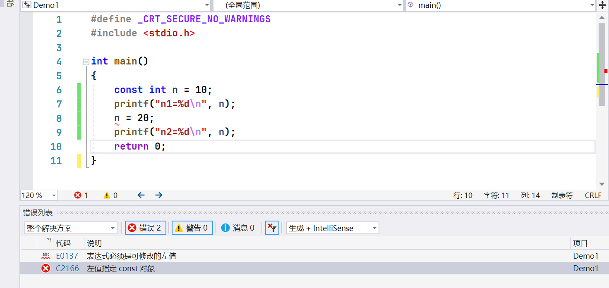
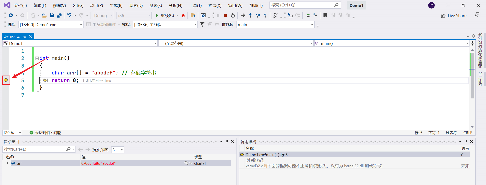
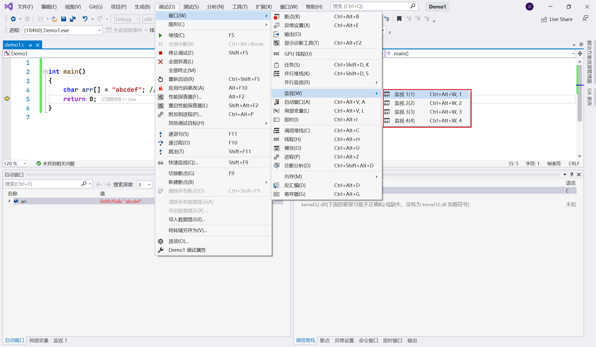
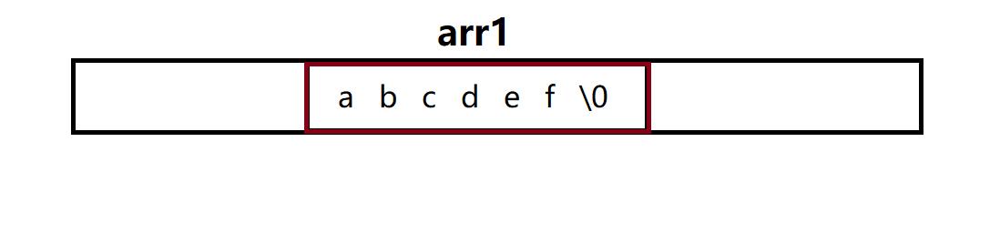
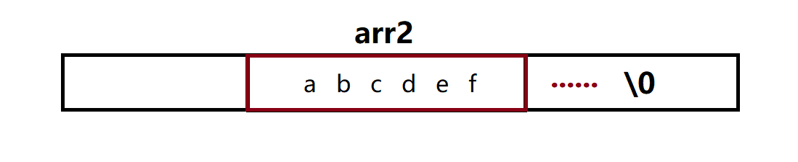
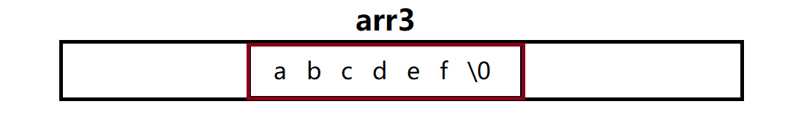
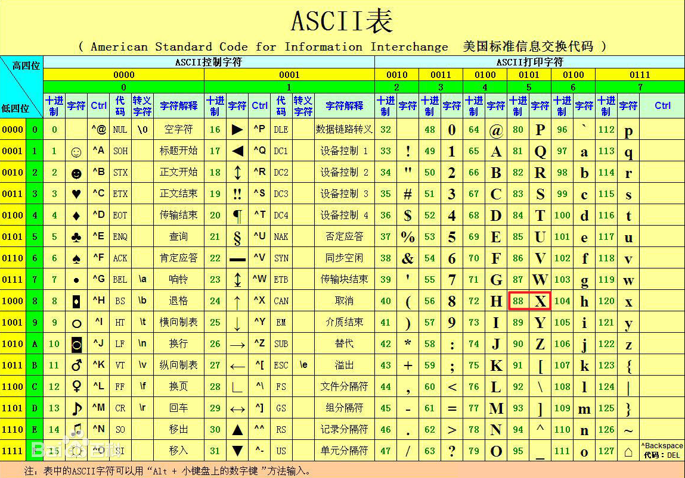
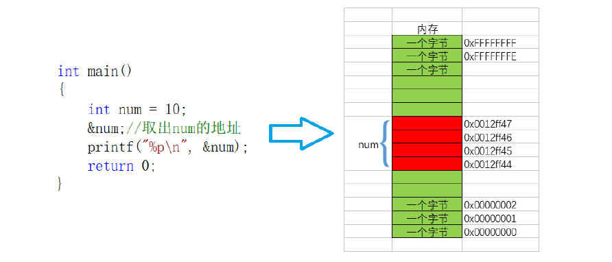

本章重点

- 第一个C语言程序
- 数据类型
- 变量、常量
- 字符串+转义字符+注释
- 选择语句
- 循环语句
- 函数
- 数组
- 操作符
- 常见关键字
- define 定义常量和宏
- 指针

# 1 第一个C语言程序

1. 打开VS

2. 创建项目


3. 创建源文件


4. 打印 hello word

```c
#include <stdio.h>

int main()
{
	printf("hello word\n");
return 0;
}
```

解释：

```c
// 1、主函数
// c语言代码中一定要有main函数，主函数
// 主函数写法
int main()
{

return 0;
}

// 2、#include <stdio.h>
// printf是一个库函数，专门用来打印数据的
// 不能直接用,需要包含<stdio.h>头文件，即：#include <stdio.h>
// std - 标准
// i - input
// o - output

// 3、/n 换行 打印完换行

// 4、return 0;
// 代码正常运行，返回0，异常返回非0.


```

# 2 数据类型
  
| 数据类型  | 说明         |     字节| 
| --------- |:------------ | --- |
| char      | 字符数据类型 |  1   |
| short     | 短整型       |  2   |
| int       | 整形         | 4    |
| long      | 长整型       |  4   |
| long long | 更长的整形   |   8  |
| float     | 单精度浮点数 |   4  |
| double    | 双精度浮点数 |   8  |

# 3 变量、常量

生活中的有些值是不变的（比如：圆周率，性别，身份证号码，血型等等）
有些值是可变的（比如：年龄，体重，薪资。
不变的值，C语言中用**常量**的概念来表示，变得值C语言中用**变量**来表示。

## 3.1 变量定义方法

数据类型 变量名 = 值

```c
int age = 150;
```
## 3.2 变量的使用

```c
#define _CRT_SECURE_NO_WARNINGS
#include <stdio.h>

int main()
{
	// 1.初始化
	int num1 = 0;
	int num2 = 0;
	 
	// 输入两个整数
	scanf("%d %d",&num1,&num2); // 按两个整型数值读取，读取后放入到num1 num2中，
	// %d 占位符，两个整数。&num，取地址，scanf需要地址，&取地址。
	// scanf安全问题解决,首行加入：#define _CRT_SECURE_NO_WARNINGS
	
	// 2.求和
	int sum = num1+num2;

	// 3.输出
	printf("%d\n",sum)
}
```

## 3.3 变量的作用域和生命周期

**作用域**

作用域（scope）是程序设计概念，通常来说，一段程序代码中所用到的名字并不总是有效/可用的,而限定这个名字的可用性的代码范围就是这个名字的作用域。

1. 局部变量的作用域是变量所在的局部范围。

2. 全局变量的作用域是整个工程。

**生命周期**

变量的生命周期指的是变量的创建到变量的销毁之间的一个时间段

1. 局部变量的生命周期是：进入作用域生命周期开始，出作用域生命周期结束。

2. 全局变量的生命周期是：整个程序的生命周期。


## 3.3 常量

C语言中的常量和变量的定义的形式有所差异。

C语言中的常量分为以下四种：

1. 字面常量，自身就是常量，字面意义的常量
2. 由 `const` 修饰的常变量
3. 由 `#define` 定义的标识符常量
4. 枚举常量

## 3.1 字面常量

例如：

```c
int main()  
{  
    30;//数字常量  
    'a';//字符常量  
    'abcd';//字符串常量  
    //以上常量可以直接输出  
    printf("30,'a','abcd'");  
    return 0;  
}
```

## 3.2 由 `const` 修饰的常变量

定义常量方式：`const 数据类型 常量名 = 值;`

由const定义的常变量本质上依旧为变量，但其具有==不可变==的属性 ;

首先变量可以修改：

```c
int main()
{
	int n = 10;
	printf("n1=%d\n",n);
	n = 20;
	printf("n2=%d\n",n);
	return 0;
}
```

用const定义后：

```c
int main()
{
	const int n = 10;
	printf("n1=%d\n", n);
	n = 20;
	printf("n2=%d\n", n);
	return 0;
}
```

报错：



**解释：**
变量 n 的值是可以后续赋值改变的，但用const定义之后，编译器不允许修改其值，其值不可再改变，如果再次被赋值就会被报错。

在c语言中，const修饰的 n ,**本质**是变量，但是不能被修改，有常量的属性，同样因为是变量也不可用于数组的定义。

## 3.3 由 `#define` 定义的标识符常量

定义方式：``#define 常量名 值`

由 `#define` 定义的标识符常量，可视为一般的字面常量，不可修改。

```c
#define MAX 100
#define STR "str" 
int main()
{
	printf("%d\n",MAX);
	int a = MAX;
	printf("a=%d",a);
	printf("%s\n",STR);
	return 0;
}
```

注：`#define` 定义的不一定是整数类型的。

## 3.4 枚举常量

生活中有些值可以一 一列举出来的，比如性别（男、女），三原色（红、绿、蓝）等，将这些可能的取值枚举出来，未来可能的取值即为枚举常量。

看以下代码：

```c
enum Color // 声明变量(三原色)
{
//未来可能的取值,即枚举常量
	RED, // 对应的值从0开始
	GERRN,
	BLUE
};

int main()
{
enum Color c = RED;
// RED = 10; // 报错，枚举常量不可修改
return 0;
}
```

# 4 字符串+转义字符+注释
## 4.1 字符串

-   `"abcdef"`  这种由双引号引起来的一串字符，称为字符串字面值，或者简称字符串。
- 字符串就是字符数组，好多个字符串起来的一组数据。

```c
int main()
{
	char c = 'c';//定义了一个字符数据类型c
	
	"abcdef" ;// 这种由双引号引起来的一串字符称为字符串字面值，或者简称字符串。
	return 0;
}
```

**注：** c语言中有字符类型没有字符串类型，若想存储需要放入字符数组中。

如下：

```c
int main()
{
	char arr[] = "abcdef"; // 存储字符串
	return 0;
}
```

既然字符串存储在字符数组中，那么数组中存储了哪些东西呢？

1. 在VS中按F10对代码进行调试，页面左端会显示黄色的小三角（如下图所示），三角号到哪行代码即运行到哪行，按一次F10 运行一行，直到运行到最后一行。



2. 调试后，点击 `调试->窗口->监视->监视(1)` 



3. 输入监视的对象，此文中为`arr` , 并展开。


我们发现数组`arr`大小为7并不是6，除了所要存储的 `abcdef` 外还另外放入了 `\0`  ，说明还默认存储了一个 `\0`  ，这个 `\0` 即为字符串的**结束标志**。

**`\0` 作为字符串的结束标志非常重要**

为什么重要呢？

思考以下代码输出结果：
 
```c
#include <stdio.h>

int main()
{
	char arr1[] = "abcdef";
	char arr2[] = { 'a','b','c','d','e','f' };
	char arr3[] = { 'a','b','c','d','e','f','\0'};
	
	printf("%s\n", arr1); // %s 为输出字符串
	printf("%s\n", arr2);
	printf("%s\n", arr3);

	return 0;
}
```

输出结果：

```
abcdef
abcdef烫烫烫烫烫abcdef
abcdef
```

**解释：**

1. 首先查看一下 arr1 和 arr2 存储的内容


arr1用字符串初始化，编译系统会自动加入 `\0` ，所以arr1中有 `\0` ; 当我们主动给arr2中放入 `abcdef` ，数组中并没有 `\0` 。

2. 当我们用 `%s` 输出字符串时，输出结果为：


字符串作为一维数组存放在内存中，当程序遇到 `\0` 时判断字符串结束，如果没遇到，编译器自动向后打印直到遇见 `\0` 结束 。


**对于arr1**

数组 arr1 从 `a` 开始输出，遇到 `\0` 结束，arr1是以字符串初始化，所以编译系统会默认加入 `\0` 。
在计算字符串长度的时候` \0` 是结束**标志**，不算作字符串内容，不打印。所以arr1打印结果为 `abcdef`


**对于arr2**

当我们主动给arr2中放入 `abcdef` ，编译系统并不会自动加入 `\0`。
数组arr2也是从 `a` 开始打印，但是不同的是 arr2 中并没有 `\0` ，而且arr2后面还有内存，内存中存储了其他内容，所以程序继续往后打印，直到遇到了一个 `\0` 结束打印，这就是为什么arr2会打印我们指定外的内容。

**对于arr3**

arr3中主动添加 `\0` 和arr1效果相同。

-----

另一个案例：用 `strlen` 求字符串长度

```c
#include <stdio.h>
#include <string.h>

int main()
{
char arr1[] = {'a','b','c'};
char arr2[4] = {'a','b','c'};
printf("%d\n",strlen(arr1));
printf("%d\n",strlen(arr2));
return 0;
}

```

结果：
```c
arr1 随机
arr2 为3
```

因为 `strlen` 是计算字符串的长度，arr1中没有 `\0` 所以不知道字符串什么时候截止，长度随机。

对于arr2，长度为4，但是只放入了3个值，为不完全初始化，未放入值的位置默认为 0 ，数字0对应的值为0，`\0` 对应的ASCII值也为0，这两个本质没有什么区别，所以编译器遇到了值0，就作为字符串的结束标志，所以arr2的字符串长度只有3。

```c
0 - 数字零，值为0
'0' - 字符零，ASCII值为48
'\0' - 字符，ASCII值为0
```

`strlen` 求字符串的长度的，`/0` 之前的长度，不包含 `/0` ，只能求字符串的长度;
`sizeof` 计算变量、数组、类型的大小-单位是字节，在字符串中需要包含 `/0`

==总结：==

- c语言中没有字符串类型，若想存储需要放入字符数组中。
-  字符串的结束标志是一个 \\0的转义字符。在计算字符串长度的时候 \\0是结束标志，不算作字符串内容。

## 4.2 转义字符

### 4.2.1 概念

C中定义了一些字母前加""来表示常见的那些不能显示的ASCII字符，如\\0,\\t,\\n等，就称为转义字符。

| 转义字符 | 释义                                               |
| -------- | -------------------------------------------------- |
| \\\?     | 在书写连续多个问号时使用，防止他们被解析成三字母词 |
| \\\`     | 用于表示字符常量\`                                 |
| \\"      | 用于表示一个字符产内部的双引号                     |
| \\\\     | 用于表示一个反斜杠，防止它被解释为一个转义序列符   |
| \\a      | 警告字符，蜂鸣                                     |
| \\b      | 退格符                                             |
| \\f      | 进纸符                                             |
| \\n      | 换行                                               |
| \\r      | 回车                                               |
| \\t      | 水平制表符                                         |
| \\v      | 垂直制表符                                         |
| \\ddd    | ddd表示1~3个八进制的数字。如：\\130                |
| \\xdd    | dd表示2个十六进制数字。如:\\x30                    |

### 4.2.2 详解

**1. `\?`**

早期编译器会把三字母词 `??)` 解析成 `]` ；把三字母词 `??(` 解析成 `[` 。若不想这样解析，在问号前面加上 `\` ,此时的 `?` 不再是三字母词里的问号。目前编译器不在支持三字母词。

**2. `\'`**

当想打印字符 `'` 时，按如下编写会报错。


因为编译器把前两个单引号看成了一对，认为前两个单引号中间括了一个字符，最后一个单引号落单了，编译器无法解析。

在中间单引号前加 `\` 转义即可，让它单纯的就是一个单引号。

```c
int main()
{
	printf("%c\n", '\'');

	return 0;
}
```

**3. `\"`**

当想打印字符 `"` 时，用 `\"`，与 `\'` 道理相同。

```c
int main()
{
	printf("%s\n", "\"");

	return 0;
}
```

**4. `\\`**

将 `\` 转义成单纯的斜杠。

当打印字符串 `abcd\0ef` 时只会输出 `abcd` ,因为遇到了字符串的结束标志\\0，此时在 `\` 前在加一个 `\` ，把斜杠转移成普通的斜杠，不让`\0` 组成转义字符。

```c
int main()
{
	printf("abcd\\0ef");
	return 0;
}

// 结果
// abcd\0ef
```

**5. `\n` 和`\r`**

\\n : 对输出进行换行

\\r : 对输出进行回车

**6. `\t`**

和电脑的Tab键效果相同。

**7. `\ddd`**

ddd表示1~3个八进制的数字。如：\\130。130为八进制的数字（幺叄零），不是一百三。

当打印 \\130 时打印出来的是大写的X


因为 \\ddd 表示的是8进制的ddd转换成10进制的数字，即8进制的130，转换成10进制的88， 而88在ASCII码上对应的即为大写的X，所以打印字符88，即打印88在ASCII码上对应的值X。



**8. `\xdd`**

dd表示2个十六进制数字。如:\\x60 。`\x60` 是将60这个十六进制的数字转换成十进制的96。然后打印出96对应的ASCII码的值。 

==总结：==

只需知道 `\?`  `\'`  `\"` `\\` `\n` `\r` `\t` `\ddd` `\xdd` 即可。

## 4.3 注释

注释是对代码的解释和说明文字。

C语言中的注释分为两种：

### 4.3.1 C++风格的注释

```c
// 这是单行注释文字
```

### 4.3.2 C语言风格的注释

```c
/*
这是多行注释文字
这是多行注释文字
这是多行注释文字
*/
```

### 4.3.3 使用的技巧

​如果我们要对代码进行解释，那么就可以使用注释。

​当注释的内容比较少，一行就写完了，可以用C++风格的注释。

​如果注释的内容比较多，需要写在多行，那么可以使用C风格的注释。

### 4.3.4 注意

注释的内容不会参与编译和运行的，仅仅是对代码的解释说明而已。

​所以，不管在注释当中写什么内容，都不会影响代码运行的结果。

C语言风格的注释不能嵌套注释

C++风格的注释可以注释一行也可以注释多行


# 5 选择语句

选择结构指的是进行逻辑判断，当满足与某些条件的时候才会执行某些语句。
C语言包括两类选择语句，if语句和switch语句。

# 6 循环语句

C语言包括三类循环语句，while语句、for语句、do ... while语句。

# 7 函数

```c
#include <stdio.h>
int main()
{
	int num1 = 0;
	int num2 = 0;
	int sum = 0;
	printf("输入两个操作数:>");
	scanf("%d %d", &num1, &num2);
	sum = num1 + num2;
	printf("sum = %d\n", sum);
	return 0;
}

// 上述代码，写成函数如下：
#include <stdio.h>
int Add(int x, int y)
{
	int z = x+y;
	return z;
}
int main()
{
	int num1 = 0;
	int num2 = 0;
	int sum = 0;
	printf("输入两个操作数:>");
	scanf("%d %d", &num1, &num2);
	sum = Add(num1, num2);
	printf("sum = %d\n", sum);
	return 0;
}

```

- 函数的特点就是简化代码，代码复用。

# 8 数组

- 一组相同类型的集合

```c
int arr[3] = {1,2,3}
```


C语言规定：数组的每个元素都有一个下标，下标是从0开始的。
数组可以通过下标来访问的。

```c
printf("%d ",arr[0])

// 0
```

# 9 操作符

## 算数操作符

```c
+ - * / %
```

## 移位操作符

```c
>> <<
```

<<（左移）和>>（右移）。

左移运算是将一个二进制位的操作数按指定移动的位数向左移动，移出位被丢弃，右边移出的空位一律补 0 。

右移运算是将一个二进制位的操作数按指定移动的位数向右移动，移出位被丢弃，左边移出的空位一律补 0 ，或者补符号位，这由不同的机器而定。在使用补码作为机器数的机器中，正数的符号位为  0 ，负数的符号位为 1 。

## 位操作符

```c
& ^ |
```

| 符号 | 描述 | 运算规则                 |
| ---- | ---- | ------------------------ |
| &    | 按位与   | 两个位都为1时，结果才为1 |
| \|   | 按位或   | 两个位都为0时，结果才为0 |
| ^    | 按位异或 | 两个位相同为0，相异为1   |


```c
	int a = 3;
	int b = 5;
	
	int c = a & b;
	int d = a | b;
	int e = a ^ b;
	
	// a 011
	// b 101
	
	// c 001
	// d 111
	// e 110
```

## 赋值操作符

```c
= += -= *= /= &= ^= |= >>= <<= 
```

## 单目操作符

```c
! 逻辑反操作

- 负值

+ 正值

& 取地址

sizeof 操作数的类型长度（以字节为单位）

~ 对一个数的二进制按位取反

-- 前置、后置 --

++ 前置、后置++

* 间接访问操作符(解引用操作符)

(类型) 强制类型转换 int a = (int)3.14;
```

**sizeof：**
```c
int main()
{
int a = 10;
//sizeof计算的是变星/类型所点交间的太小，单位是字节
printf("%d\n",sizeof (a));//4
printf ("%din",sizeof(int));//4
printf("%d\n",sizeof a);//4
printf("%d\n",sizeof int);//报错

int arr[10] = {0};
printf("%d\n",sizeof (arr));//40
printf("%d\n",sizeof (arr)/sizeof (arr[0]));//计算数组元素个数
}

```

**~：**
```c
int main()
{
int a = 0;//4字节 32bit位
int b = ~a;//按(2进制)位取反

printf("%d\n",b);// -1
}
```

原码、反码、补码是计算机中对数字的二进制表示方法。
只要是整数在内存中存储的都是二进制的补码，使用的、打印的是原码。

正数：原码，反码，补码相同
负数：
原码-直接按照正负写出的二进制序列
反码-原码的符号位不变，其他位按位取反
补码-反码+1

原码、反码、补码之间计算规则为：
1、正整数的原码、反码、补码完全一样，即符号位固定为0，数值位相同。

2、负整数的符号位固定为1，由原码变为补码时，规则如下：原码符号位1不变，整数的每一位二进制数位求反，得到反码；反码符号位1不变，反码数值位最低位加1，得到补码。

0的二进制：    00000000 00000000 00000000 00000000

对0按位取反：11111111 11111111 11111111 11111111

所以要想将b打印出来，需要将补码转换为原码，即为以下步骤：
补码减一得到反码，反码符号位不变其他为按位取反得到原码
补码：11111111 11111111 11111111 11111111
反码：11111111 11111111 11111111 11111110
原码：10000000 00000000 00000000 00000001

## 关系操作符

\>
\>=
<
<=
!=
\==

## 逻辑操作符

```c
&&
||
```

## 条件操作符

```c
exp1 ? exp2 : exp3
```

exp1为真，exp2执行
exp1为假，exp3执行

## 逗号表达式

```c
exp1, exp2, exp3, …expN
```

## 下标引用、函数调用和结构成员

```c
[] () . ->
```


# 10 常见关键字

C语言提供了丰富的关键字，这些关键字都是语言本身预先设定好的，用户自己是不能创造关键字的。

```c
auto (省略不写) break case char const(修饰变量、常属性)
continue default(switch cause 中) do long register(定义寄存器) double else enum(枚举) extern(声明外部符号) float for
goto if int return short signed sizeof static struct(结构体) switch typedef(类型重命名) union unsigned void volatile while
```

**typedf：** 类型定义-类型重定义
```c
typedf unsigned int u_int //将无符号整形重命名为u_int

unsigned int num1 = 20
u_int num2 = 20 // 两种定义方法相同
```

**extern：** 声明外部符号

test.c
```c
int g_val = 2020;

int Add(int x,int y)
{
	int z = x+y;
	return z;
}
```

demo.c
```c
extern int g_val;
extern int Add(int,int); //声明外部函数 类似于import
```

**static：**
1、修饰局部变量
局部变量生命周期边长
```c
// 无static
void test()
{
int a = 1;
a++;
printf(a);
}

int main ()
{
	int i = 0;
	while(i<5)
	{
		test();
		i++;
	}
	return 0;
}
```
结果：2 2 2 2 2

```c
// 有static
void test()
{
static int a = 1;
a++;
printf(a);
}

int main ()
{
	int i = 0;
	while(i<5)
	{
		test();
		i++;
	}
	return 0;
}
```
结果：2 3 4 5 6

2、修饰全局变量
改变了全局变量的作用域，让静态的全局变量只能在自己所在的源文件内部使用，出了源文件就没法再使用了

test.c
```c
int g_val1 = 2023;
static int g_val2 = 2023;
```

demo.c
```c
int main()
{
printf("%d\n", g_val1);// 2023

printf("%d\n", g_val2);// 报错
return 0;
}
```

一个全局变量被static修饰，使得这个全局变量只能在本源文件内使用，不能在其他源文件内使用。

3、修饰函数
也是改变了函数的作用域-不准确
改变了函数的链接属性，外部链接属性变成内部链接属性

test.c
```c

int Add1(int x, int y)
{
return x+y;
}
static int Add2(int x, int y)
{
return x+y;
}
```

demo.c
```c
int main()
{
printf("%d\n", Add1(2, 3));// 5
printf("%d\n", Add2(2, 3));// 报错
return 0;
}
```

一个函数被static修饰，使得这个函数只能在本源文件内使用，不能在其他源文件内使用。

# 11 define 定义常量和宏

**定义常量：**
```c
//define定义标识符常量,定义符号MAX，其值为100
#define MAX 1000

#include <stdio.h>
int main()
{
int a = MAX;
return 0;
}
```

**定义宏：**
```c
//函数实现
int MAX(int x,int y)
{
	if (x>y)
		return x;
	else
		return y;
}

//define定义宏
#define MAX(x, y) (x>y?x:y)

#include <stdio.h>
int main()
{
int a = 20;
int b = 30;

// 函数
int max = MAX(a, b);
printf("max = %d\n", max);

// 宏的方式
max = MAX(a, b); // max = (a>b?a:b);
printf("max = %d\n", max);
return 0;
}
```

`#define MAX(x, y) (x>y?x:y)` 将`MAX(x, y)` 替换成 `(x>y?x:y)`

# 12 指针
## 12.1 内存
内存是电脑上特别重要的存储器，计算机中程序的运行都是在内存中进行的 。
所以为了有效的使用内存，就把内存划分成一个个小的内存单元，每个内存单元的大小是1个字节。
为了能够有效的访问到内存的每个单元，就给内存单元进行了编号，这些编号被称为该内存单元的地址。

内存的地址是怎么产生的，一个内存单元是多大的空间？

电脑有32位的和64位的，队友32位的电脑，有32根地址线/数据线，每根线无非就是通电，不通电，两种情况。所以，一共有 $2^{32}$ 中情况，对应 $2^{32}$ 个地址。通常，一个内存单元可以存储一个字节（即8位）的数据，因此在大多数计算机系统中，一个内存单元的大小为 8 bit位或 1 字节。

变量是创建内存中的（在内存中分配空间的），每个内存单元都有地址，所以变量也是有地址的。取出变量地址如下：
```c
#include <stdio.h>
int main()
{
int num = 10;
&num;//取出num的地址
//注：这里num的4个字节，每个字节都有地址，取出的是第一个字节的地址（较小的地址）
printf("%p\n", &num);//打印地址，%p是以地址的形式打印
return 0;
} 
```


那如何存储地址，需要定义指针变量。
```c
int num = 10;
int* p = &num;//p的类型为int*，p是整形指针变量
```

p中存的是地址值，对p进行解引用操作 `*p` ,找到指向的对象`num` ,`*` 即为解引用操作符。

```c
#include <stdio.h>
int main()
{
int num = 10;
int* p = &num;
*p = 20; // 将p
printf("num = %d\n",num) // 20
return 0;
}
```

以整形指针举例，可以推广到其他类型，如：
```c
#include <stdio.h>
int main()
{
char ch = 'w';
char* pc = &ch;
*pc = 'q';
printf("%c\n", ch);
return 0;
}
```

## 12.2 指针变量的大小

```c
#include <stdio.h>
//指针变量的大小取决于地址的大小
//32位平台下地址是32个bit位（即4个字节）
//64位平台下地址是64个bit位（即8个字节）
int main()
{
printf("%d\n", sizeof(char *));
printf("%d\n", sizeof(short *));
printf("%d\n", sizeof(int *));
printf("%d\n", sizeof(double *));
return 0;
}
```

结论：指针大小在32位平台是4个字节，64位平台是8个字节。