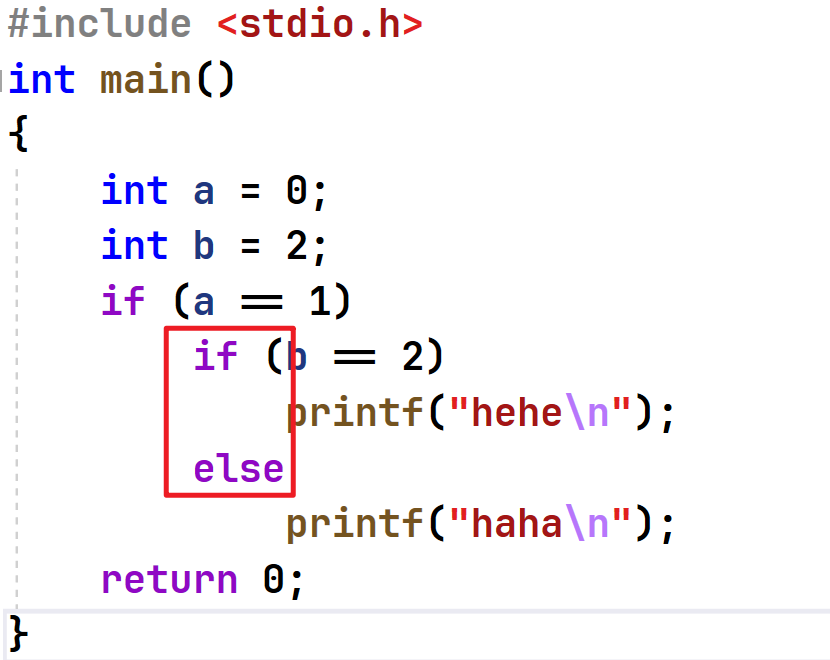
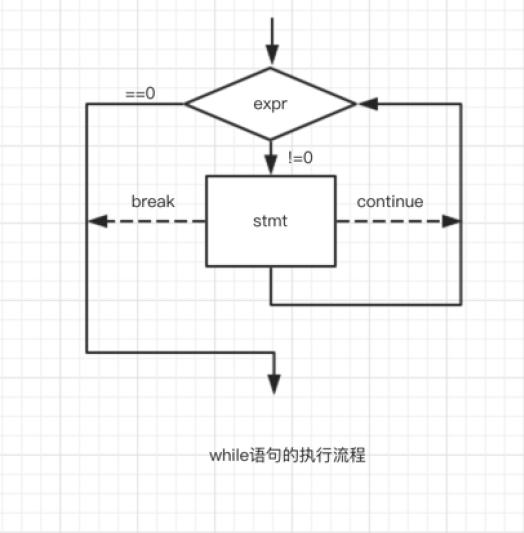

本章重点

分支语句
- if
- switch

循环语句
- while
- for
- do while

goto语句

# 1 分支语句
## 1.1 if语句
语法结构:
```c
if(表达式)
	语句;

if(表达式)
	语句1;
else
	语句2;

//多分支
if(表达式1)
	语句1;
else if(表达式2)
	语句2;
else
	语句3;
```

### 1.2.1 悬空else
首先看一下代码，运行结果为什么：
```c
#include <stdio.h>
int main()
{
	int a = 0;
	int b = 2;
	if(a == 1)
		if(b == 2)
			printf("hehe\n");
	else
		printf("haha\n");
	return 0;
}
```

结果：结果为空

==注意：== **else的匹配**-else是和它离的最近的未匹配的if进行匹配。



若想输出haha，则为一下写法：
```c
#include <stdio.h>
int main()
{
	int a = 0;
	int b = 2;
	if (a == 1)
	{
		if (b == 2)
			printf("hehe\n");
	}

	else
		printf("haha\n");
	return 0;
}
```
### 1.2.2 if书写形式的对比
```c
	//代码1
	if (condition) {
		return x;
	}
	return y;
	
	//代码2
	if (condition)
	{
		return x;
	}
	else
	{
		return y;
	}
	
	//代码3
	int num = 1;
	if (num == 5)
	{
		printf("hehe\n");
	}
	
	//代码4
	int num = 1;
	if (5 == num)
	{
		printf("hehe\n");
	}
```

代码1，代码2都表示：条件成立返回x，不成立返回y，但是代码2格式更好。

代码3，代码4相同，但是代码4格式更好。因为，代码3中的 `num == 5` 有时候会误写成一个等号，为了避免这种错误，可将代码反过来写，写成 `5 == num` 。

## 1.2 switch语句
```c
#define _CRT_SECURE_NO_WARNINGS
#include <stdio.h>
int main()
{
	int day = 0;
	scanf("%d",&day)
	switch (day)
	{
		case 1：
			printf("星期一\n");
			break;
		case 2:
			printf("星期二\n");
			break;
		case 3:
			printf("星期三\n");
			break;
		case 4:
			printf("星期四\n");
			break;
		case 5:
			printf("星期五\n");
			break;
		case 6:
			printf("星期六\n");
			break;
		case 7:
			printf("星期天\n");
			break;
	}
	return 0;
}
```

注意：
```c
switch(整型表达式)
{
语句项；
}

case 整形常量表达式:
语句
```
switch 后是**整型**表达式，case 后是**整形常量**表达式。

### 1.2.1 case穿透

有时候我们的需求变了：
1. 输入1-5，输出的是“工作日”;
2. 输入6-7，输出“休息日”
```c
#define _CRT_SECURE_NO_WARNINGS
#include <stdio.h>
int main()
{
	int day = 0;
	scanf("%d",&day)
	switch (day)
	{
		case 1：
		case 2:
		case 3:
		case 4:
		case 5:
			printf("工作日\n");
			break;
		case 6:
		case 7:
			printf("休息日\n");
			break;
	}
	return 0;
}
```

> 在最后一个 case 语句的后面加上一条 break语句。（之所以这么写是可以避免出现在以前的最后一个 case 语句后面忘了添加 break语句）。

### 1.2.2 default字句
当 `switch` 表达式的值并不匹配所有`case` 标签的值时，这个`default` 子句后面的语句就会执行。
所以，每个`switch`语句中只能出现一条`default`子句。
但是它可以出现在语句列表的任何位置，而且语句流会像执行一个`case`标签一样执行`default`子句。

>在每个 switch 语句中都放一条default子句是个好习惯，甚至可以在后边再加一个 break 。

# 2 循环语句
## 2.1 while循环
while语句执行的流程：


```c
#include <stdio.h>
int main()
{
	int i = 1;
	while(i<=10)
	{
		printf("%d ", i);
		i = i+1;
	}
	return 0;
}
```

### 2.1.1 while语句中的break和continue

#### break介绍
```c
int main()
{
	int i = 1;
	while (i <= 10)
	{
		if (i == 5)
			break;

		printf("%d ", i);
		i = i + 1;
	}
	return 0;

}
```

结果： 1 2 3 4

总结：
其实在循环中只要遇到break，就**停止**后期的**所有的循环**，直接终止循环。
所以，while中的break是用于**永久终止循环的**。

#### continue介绍
```c
//continue 代码实例1
#include <stdio.h>
int main()
{
	int i = 1;
	while (i <= 10)
	{
		if (i == 5)
			continue;
		printf("%d ", i);
		i++;
	}
	return 0;
}
```

结果：1 2 3 4
但是此处死循环

```c
//continue 代码实例2
#include <stdio.h>
int main()
{
	int i = 0;
	while (i <= 10)
	{
		i++;
		if (i == 5)
			continue;
		printf("%d ", i);
		
	}
	return 0;
}
```
结果：1 2 3 4 6 7 8 9 10 11

**总结：**
continue是用于终止本次循环的，也就是本次循环中continue**后边的代码不会再执行**，
而是**直接跳转**到**while语句的判断部分**。进行下一次循环的入口判断。

## 2.2 for循环

## 2.3 do...while()循环

# goto语句