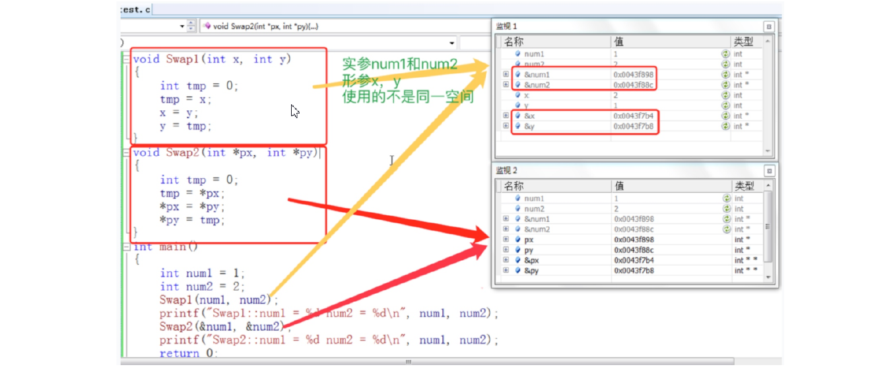
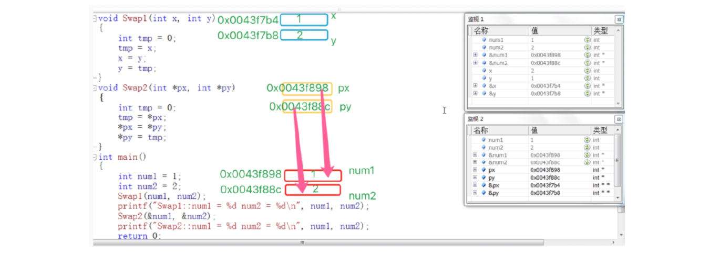
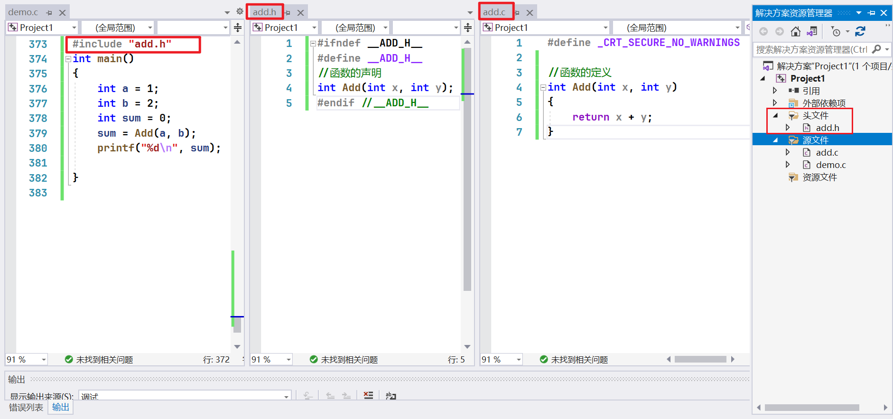
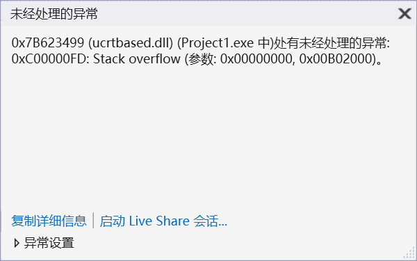

# 1 函数分类
## 1.1 库函数
库函数查询工具：
www.cplusplus.com
http://en.cppreference.com（英文版）
http://zh.cppreference.com（中文版）

## 1.2 自定义函数
```c
ret_type fun_name(para1, * )
{
	statement;//语句项
}
```
ret_type 返回类型
fun_name 函数名
para1 函数参数

>写一个函数可以交换两个整形变量的内容。P12 1:16:10

```c
#include <stdio.h>
//实现成函数，但是不能完成任务
void Swap1(int x, int y)
{
	int tmp = 0;
	tmp = x;
	x = y;
	y = tmp;
}
// x y 和 num1 num2是单独的地址，没有关系

//正确的版本
void Swap2(int* px, int* py)
{
	int tmp = 0;
	tmp = *px;
	*px = *py;
	*py = tmp;
}
int main()
{
	int num1 = 1;
	int num2 = 2;
	Swap1(num1, num2);
	printf("Swap1:num1 = %d num2 = %d\n", num1, num2);
	Swap2(&num1, &num2);
	printf("Swap2:num1 = %d num2 = %d\n", num1, num2);
	return 0;
}
```

# 2 函数的参数
## 2.1 实参
真实传给函数的参数，叫实参。
实参可以是：常量、变量、表达式、函数等。
无论实参是何种类型的量，在进行函数调用时，它们都必须有确定的值，以便把这些值传送给形
参。

## 2.2 形参
形式参数是指函数名后括号中的变量，因为形式参数只有在函数被调用的过程中才实例化（分配内
存单元），所以叫形式参数。形式参数当函数调用完成之后就自动销毁了。因此形式参数只在函数
中有效。
上面`Swap1` 和`Swap2` 函数中的参数`x，y，px，py` 都是**形式参数**。
在main函数中传给`Swap1` 的`num1` ， `num2` 和传给`Swap2` 函数的`&num1` ， `&num2` 是**实际参数**。
这里我们对函数的实参和形参进行分析：

代码对应的内存分配如下：

这里可以看到`Swap1` 函数在调用的时候， `x` ，` y` 拥有自己的空间，同时拥有了和实参一模一样的内容。
当实参传给形参的时候，形参其实是实参的一份临时搓贝
，对形参的修改是不会改变实参的。

# 3 函数的调用
## 3.1 传值调用
函数的形参和实参分别占有不同内存块，对形参的修改不会影响实参。

## 3.2 传址调用
传址调用把变量的内存地址传递给函数参数。
这种传参方式可以让函数和函数外边的变量建立起真正的联系，也就是函数内部可以直接**操作函数外部的变量**。

# 3.3 练习
```c
// 写一个函数，实现一个整形有序数组的二分查找。
// 找到返回下标。未找到返回-1

int binarySearch(int arr[],int n,int size)
{
	
	int left = 0;
	int right = size - 1;
	int mind = 0;

	while (left<=right)
	{
		mind = (left + right) / 2;
		if (arr[mind] < n)
		{
			left = mind+1;
		}
		else if (arr[mind] > n)
		{
			right = mind-1;
		}
		else
		{
			return mind;
		}
	}
	return -1;
}

int main()
{	
	int arr[] = {1,2,3,4,5};
	int n = 2;
	int size = (sizeof(arr) / sizeof(arr[0]));
	int index = binarySearch(arr,n,size);
	if (-1 != index)
	{
		printf("找到了，下标为：%d\n", index);
	}
	else
		printf("没找到");
	return 0;
}
```
**注意：** `int size = (sizeof(arr) / sizeof(arr[0]));` 要写在函数外。`mind = (left + right) / 2;` 要写在循环内。

```c
// 写一个函数，每调用一次这个函数，就会将num 的值增加1。

void Add(int* p)
{
	(*p)++;
}

int main()
{
	int num = 0;
	Add(&num);
	printf("num = %d\n", num);
	Add(&num);
	printf("num = %d\n", num);
	Add(&num);
	printf("num = %d\n", num);
	return 0;
}
```
**注意：**`(*p)++;` 不可写成 `*p++` ，因为`++` 级别较高 `*p++` 的话 `++` 是作用在 `p` 上的，不是作用在 `*P` 上的。

# 4 函数的嵌套调用和链式访问
## 4.1 嵌套调用
```c
#include <stdio.h>
void new_line()
{
	printf("hehe\n");
}
void three_line()
{
	int i = 0;
	for(i=0; i<3; i++)
	{
		new_line();
	}
}
int main()
{
	three_line();
	return 0;
}
```

## 4.2 链式访问
> 把一个函数的返回值作为另外一个函数的参数。
```c
#include <stdio.h>
int main()
{
	printf("%d", printf("%d", printf("%d", 43)));
	return 0;
}
```
结果：4321
注意：printf函数的返回值是打印在屏幕上字符的个数

# 5 函数的声明和定义 
## 5.1 函数的声明
1. 告诉编译器有一个函数**叫什么**，**参数**是什么，**返回类型**是什么。但是具体是不是存在，函数声明决定不了。
2. 函数的声明一般出现在函数的使用之前。要满足先声明后使用。
3. 函数的声明一般要放在头文件中的。

## 5.2 函数的定义
函数的定义是指函数的具体实现，交待函数的功能实现。


**注意：**
函数的声明放在头文件中，定义放在单独的`.c` 文件中。

自己创建的函数需要引头文件，`#include "add.h"` 。
`#ifndef __ADD_H__` `#define __ADD_H__` `#define __ADD_H__` 是为了防止同一个头文件被引用多次。

# 6 函数的递归
## 6.1 什么是递归
程序调用自身的编程技巧称为递归（ recursion）

简单的递归：
```c
int main()
{
	printf("hehe")
	main()
	return 0;
}
```

会报错：Stack overflow 栈溢出


## 6.2 递归的两个必要条件
- 存在限制条件，当满足这个限制条件的时候，递归便不再继续。
- 每次递归调用之后越来越接近这个限制条件。


