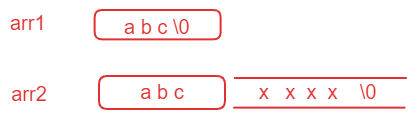
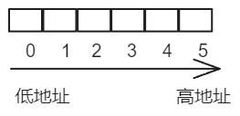
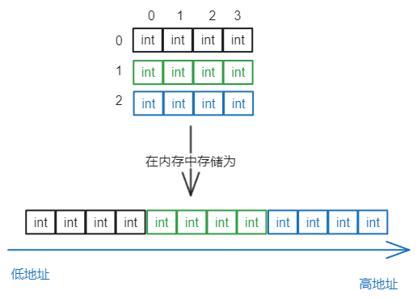

# 1 一维数组

## 1.1 数组的创建
```c
type_t arr_name [const_n];
//type_t 是指数组的元素类型
//const_n 是一个常量表达式，用来指定数组的大小
```

## 1.2 数组的初始化
```c
int arr1[10] = {1,2,3}; // 不完全初始化，剩下的元素默认为0
int arr2[] = {1,2,3,4};
int arr3[5] = {1，2，3，4，5}；

char arr4[3] = {'a',98, 'c'};
char arr5[] = {'a','b','c'};
char arr6[] = "abcdef";
```

```c
char arr1[] = "abc";
char arr2[] = {'a','b','c'};

printf("%d\n",sizeof(arr1)); // 4
printf("%d\n",sizeof(arr2)); // 3
printf("%d\n",strlen(arr1)); // 3
printf("%d\n",strlen(arr2)); // 随机值
```

`sizeof` 计算大小；`strlen` 求字符串对的长度，遇到`\0` 才停止，求得是 `\0` 前的长度。 

## 1.3 一维数组的使用
使用下标访问
```c
char arr[] = "abcdef";
printf("%c\n",arr[3]); //c
```
## 1.4 一维数组的存储
==数组在内存中是连续存放的==


# 2 二维数组
## 2.1 二维数组的创建
```c
int arr[3][4]; // 3行4列
```
## 2.2 二维数组的初始化
```c
int arr[3][4] = {1,2,3,4};
int arr[3][4] = {{1,2},{4,5}};
int arr[][4] = {{2,3},{4,5}};//二维数组如果有初始化，行可以省略，列不能省略
```

## 2.3 二维数组的使用
使用下标访问
```c
int main()
{
	int arr[3][4] = { {1,2,3},{4,5,6} };
	int i = 0;
	for (i = 0;i < 3; i++)
	{
		int b = 0;
		for (b = 0; b < 4; b++) {
			printf("%d ", arr[i][b]);
		}
		printf("\n");
	}
}
```

## 2.4 二维数组的存储



# 3  数组作为函数参数
当数组传参的时候，实际上只是把数组的首元素的地址传递过去了。
所以即使在函数参数部分写成数组的形式：`int arr[] ` 表示的依然是一个指针：`int *arr`  。
```c
// 冒泡排序
void bubble_sort(int arr[], int sz)//参数接收数组元素个数
{

	int i = 0;
	for (i = 0; i < sz - 1; i++)
	{
		int j = 0;
		for (j = 0; j < sz - i - 1; j++)
		{
			if (arr[j] > arr[j + 1])
			{
				int tmp = arr[j];
				arr[j] = arr[j + 1];
				arr[j + 1] = tmp;
			}
		}
	}
}
int main()
{
	int arr[] = { 3,1,7,5,8,9,0,2,4,6 };
	int sz = sizeof(arr) / sizeof(arr[0]);
	bubble_sort(arr, sz);//是否可以正常排序？
	int i = 0;
	for (i = 0; i < sz; i++)
	{
		printf("%d ", arr[i]);
	}
	return 0;
}
```

当数组本来就是按升序的顺序，但是程序还是会一个一个比较，如何优化？使用标签判断数组是否为升序得顺序。
```c
void bubble_sort(int arr[], int sz)//参数接收数组元素个数
{

	int i = 0;
	for (i = 0; i < sz - 1; i++)
	{
		int flag = 1; // 假设这一趟要排序的数据已经有序
		int j = 0;
		for (j = 0; j < sz - i - 1; j++)
		{
			if (arr[j] > arr[j + 1])
			{
				int tmp = arr[j];
				arr[j] = arr[j + 1];
				arr[j + 1] = tmp;
				flag = 0; // 本趟排序的数据其实不完全有序
			}
		}
		if(flag==1)
		{
		break;
		}
	}
}
```

# 4 数组名是什么
```c
#include <stdio.h>
int main()
{
	int arr[10] = {1,2，3,4,5};
	printf("%p\n", arr);
	printf("%p\n", &arr[0]);
	printf("%d\n", *arr);
//输出结果相同
	return 0;
}
```

数组名是数组首元素的地址。但有两个例外

1. sizeof(数组名)，计算整个数组的大小，sizeof内部单独放一个数组名，数组名表示整个数组。
2. &数组名，取出的是整个数组的地址。&数组名，数组名表示整个数组。
除此1,2两种情况之外，所有的数组名都表示数组首元素的地址。