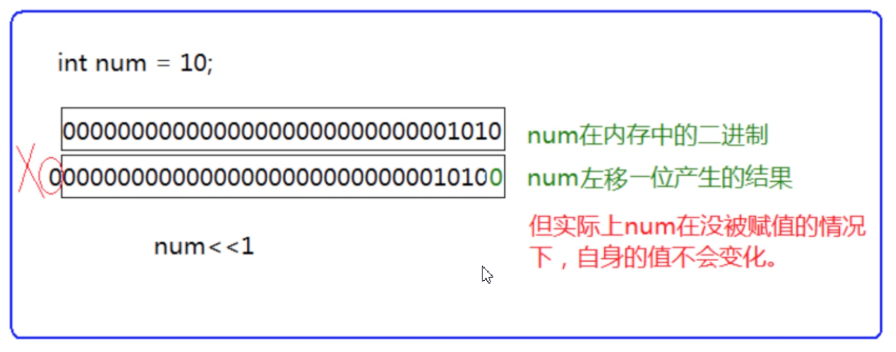
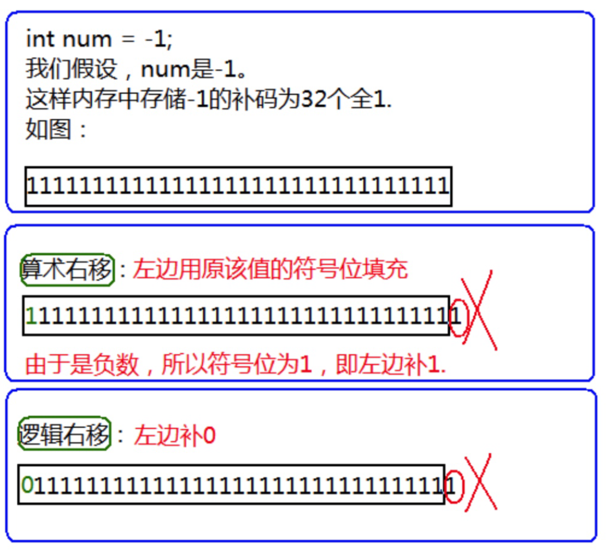

# 1 移位操作符
```c
<< 左移操作符
>> 右移操作符
注：移位操作符的操作数只能是整数
```

## 1.1 左移操作符
> 左边抛弃、右边补0

## 1.2 右移操作符
> 1. 逻辑移位
左边用0填充，右边丢弃
>2. 算术移位（常用）
左边用原该值的符号位填充，右边丢弃

# 2 位操作

| 符号 | 描述 | 运算规则                 |
| ---- | ---- | ------------------------ |
| &    | 按位与   | 两个位都为1时，结果才为1 |
| \|   | 按位或   | 两个位都为0时，结果才为0 |
| ^    | 按位异或 | 两个位相同为0，相异为1   |
注：他们的操作数必须是整数。

## 练习1
> 不能创建临时变量（第三个变量），实现两个数的交换。
```c
#include <stdio.h>
int main()
{
	int a = 10;
	int b = 20;
	a = a^b;
	b = a^b;
	a = a^b;
	printf("a = %d b = %d\n", a, b);
	return 0;
}
```

## 练习2
```c
#include <stdio.h>
int main()
{
	int num = -1;
	int i = 0;
	int count = 0;//计数
	for(i=0; i<32; i++)
	{
		if( 1==((num>>i)&1) )
			count++;
	}
	printf("二进制中1的个数 = %d\n",count);
	return 0;
}
```

# 3 单目操作符
```c
printf("%d\n", sizeof(a));
printf("%d\n", sizeof(int));
printf("%d\n", sizeof a);//可以
printf("%d\n", sizeof int);//不可以
```
`sizeof` 后面是类型时不可以省略括号。，