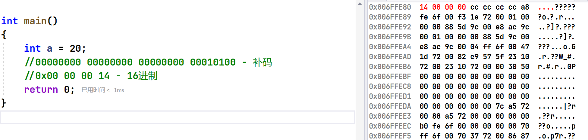
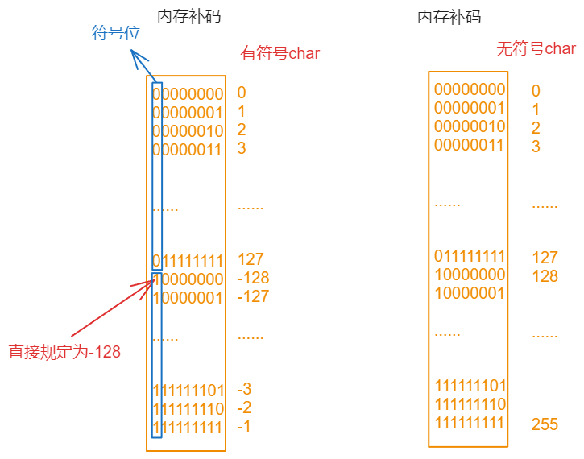
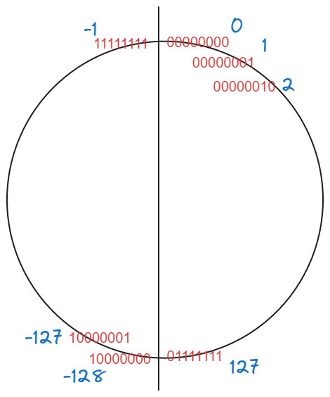
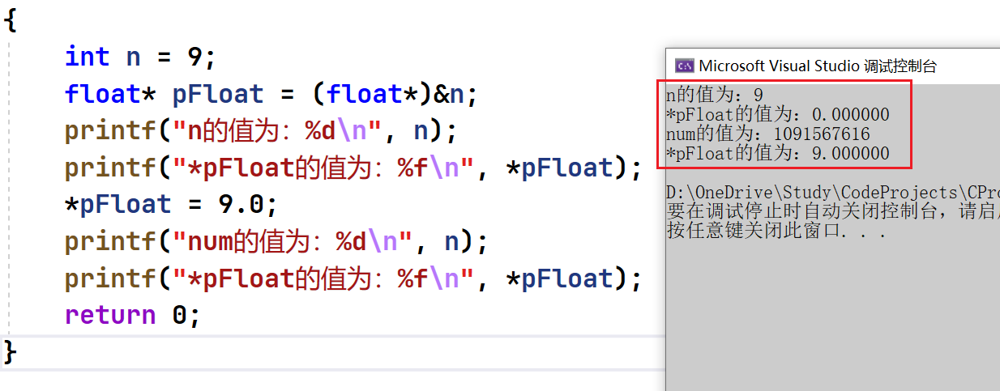
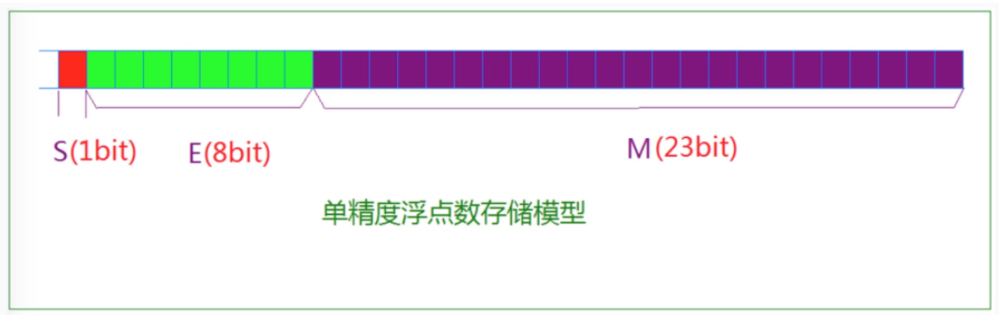
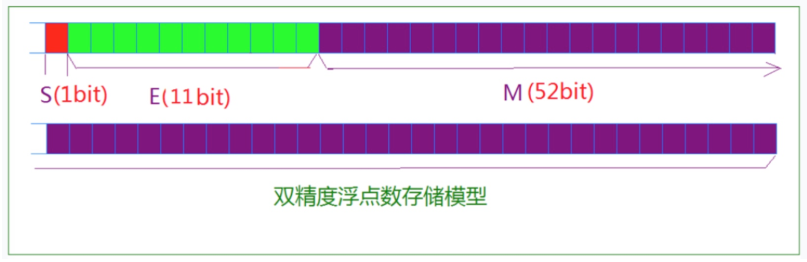

  本章重点
1. 数据类型详细介绍
2. 整形在内存中的存储：原码、反码、补码
3. 大小端字节序介绍及判断
4. 浮点型在内存中的存储解析

# 1 数据类型介绍
```c
// 基本的内置类型：
char //字符数据类型
short //短整型
int //整形
long //长整型
long long //更长的整形
float //单精度浮点数
double //双精度浮点数
```

**类型的意义：**
1. 使用这个类型开辟内存空间的大小（大小决定了使用范围）。
2. 如何看待内存空间的视角。

## 1.1 类型的基本归类

**整形：**
```c
char
unsigned char
signed char
short
unsigned short [int]
signed short [int]
int
unsigned int
signed int
long
unsigned long [int]
signed long [int]
```

**浮点数:**
```c
float
double
```

**构造类型：**
```c
> 数组类型
> 结构体类型 struct
> 枚举类型 enum
> 联合类型 union
```

**指针类型:**
```c
int *pi;
char *pc;
float* pf;
void* pv;
```

**空类型：**
```c
void 表示空类型（无类型）
通常应用于函数的返回类型、函数的参数、指针类型。
```

# 2 整形在内存中的存储

## 2.1 原码、反码、补码
计算机中的整数有三种2进制表示方法，即原码、反码和补码。
三种表示方法均有符号位和数值位两部分，符号位都是用0表示“正”，用1表示“负”。
对于数值位正数和负数的表示不同：

**正数** ： 原、反、补码都相同。

**负整数的三种表示方法各不相同：**
> **原码**
> 直接将数值按照正负数的形式翻译成二进制就可以得到原码。

> **反码**
> 将原码的符号位不变，其他位依次按位取反就可以得到反码。

> **补码**
> 反码+1就得到补码。

**对于整形来说：数据存放内存中其实存放的是补码。**

```c
int main()
{
	int a = 20;
	//00000000 00000000 00000000 00010100 - 补码
	//0x00 00 00 14 - 16进制 
	return 0;
}
```


我们可以看到对于a和b分别存储的是补码。但是我们发现顺序有点不对。
这是又为什么？

## 2.2 大小端介绍
**什么大端小端：**
> 大端（存储）模式，是指数据的低位保存在内存的高地址中，而数据的高位，保存在内存的低地址中；
> 
> **小端**（存储）模式，是指数据的**低位**保存在内存的**低地址**中，而数据的**高位**,，保存在内存的**高地址**中。


```c
int a = 20;

// 小端
// 14 00 00 00

// 大端
// 00 00 00 14
```

**为什么有大端和小端：**
这是因为在计算机系统中，我们是以字节为单位的，每个地址单元都对应着一个字节，一个字节为8 bit。但是在C语言中除了8 bit的char之外，还有16 bit的short型，32 bit的long型（要看具体的编译器），另外，对于位数大于8位的处理器，例如16位或者32位的处理器，由于寄存器宽度大于一个字节，那么必然存在着一个如何将多个字节安排的问题。因此就导致了大端存储模式和小端存储模式。

### 练习1
> 请简述大端字节序和小端字节序的概念，设计一个小程序来判断当前机器的字节序。

```c
int check_sys()
{
	int a = 1;
	char* p = (char*)&a;
	if (*p ==1)
		return 1;
	else
		return 0;
}

int main()
{
	int ret = check_sys();
	//返回1，小端
	//返回0，大端
	if(ret == 1)
	{
		printf("小端\n");
	}
	else
	{
		printf("大端\n");
	}
	return 0;
}
```

优化：
```c
int check_sys()
{
	int i = 1;
	char* p = (char*)&a;
	//返回1，小端
	//返回0，大端
	return *p;
}
```

再优化：
```c

int check_sys()
{
	int a = 1;
	return (*(char*)&a);
}
```

### 练习2
```c
//输出什么？
#include <stdio.h>
int main()
{
	char a= -1;
	signed char b=-1;
	unsigned char c=-1;
	printf("a=%d,b=%d,c=%d",a,b,c);
	return 0;
}
```

结果：-1 -1 255

```txt
char a = -1;
10000000 00000000 00000000 00000001 - 原码
11111111 11111111 11111111 11111110 - 反码
11111111 11111111 11111111 11111111 - 补码

因为char是1字节，所以只能存8bit：
11111111

要求打印的类型为int类型（%d），所以需要整形提升：
11111111 11111111 11111111 11111111 - 反码

接着转换成原码打印：
10000000 00000000 00000000 00000001 - 原码

所以，最终结果为-1
```

同理，对于`a` 和`b` 为有符号位整形提升,高位补充符号位。`c` 无符号整形提升，高位补0。

### 练习3
```c
// 代码1
int main()
{
	char a = -128;
	printf("%u\n",a);
	//%d-打印十进制的有符号数字
	//%u-打印十进制的无符号数字
	return 0;
}

// 代码2
#include <stdio.h>
int main()
{
	char a = 128; // = 127+1 = -128
	printf("%u\n",a);
	return 0;
}
```

代码1和代码2结果相同。





### 练习4
```c
int i= -20;
unsigned int j = 10;
printf("%d\n", i+j); // -10
//按照补码的形式进行运算，最后格式化成为有符号整数
```

### 练习5
```c
unsigned int i;
for(i = 9; i >= 0; i--)
{
printf("%u\n",i);
}
```

死循环，因为i为无符号整形，永远大于等于0。

```c
int main()
{
	char a[1000];
	int i;
	for(i=0; i<1000; i++)
	{
	a[i] = -1-i;
	}
	printf("%d",strlen(a));
	return 0;
}
```
结果：255
char取值范围为-128到127，所以 `char a[1000]` 中存的为 `-1 -2 -3 ··· -128 127 126 ··· 1 0` ,又因为 `strlen()` 求得是`0` 前边的长度，所以结果为255

```c
#include <stdio.h>
unsigned char i = 0;
int main()
{
	for(i = 0;i<=255;i++)
	{
	printf("hello world\n");
	}
	return 0;
}
```

死循环。因为 `unsigned char` 取值范围为0-255，永远小于等于255。

# 3 浮点型在内存中的存储
## 3.1 示例
```c
int main()
{
	int n = 9;
	float *pFloat = (float *)&n;
	printf("n的值为：%d\n",n);
	printf("*pFloat的值为：%f\n",*pFloat);
	*pFloat = 9.0;
	printf("num的值为：%d\n",n);
	printf("*pFloat的值为：%f\n",*pFloat);
	return 0;
}
```

结果为：


`num` 和`*pFloat` 在内存中明明是同一个数，为什么浮点数和整数的解读结果会差别这么大？

## 3.2 浮点数存储规则
根据国际标准IEEE（电气和电子工程协会） 754，任意一个二进制浮点数V可以表示成下面的形式：
- (-1)^S * M * 2^E
- (-1)^S表示符号位，当S=0，V为正数；当S=1，V为负数。
- M表示有效数字，大于等于1，小于2。
- 2^E表示指数位。
```c
9.0
1001.0
(-1)^0 * 1.001 * 2^3
(-1)^s * M     * 2^E

S-0
M-1.001
E-3
```

```c
-5.0
-101.0
(-1)^1 * 1.01 * 2^2

S=1
M=1.01
E=2。
```

**IEEE 754规定：**
对于32位的浮点数，最高的1位是符号位S，接着的8位是指数E，剩下的23位为有效数字M。


对于64位的浮点数，最高的1位是符号位S，接着的11位是指数E，剩下的52位为有效数字M。


**IEEE 754对有效数字M和指数E，还有一些特别规定。**

**对于M：**
前面说过， `1≤M<2` ，也就是说，M可以写成`1.xxxxxx` 的形式，其中`xxxxxx`表示小数部分。

IEEE 754规定，在计算机内部保存M时，默认这个数的第一位总是1，因此可以被舍去，只保存后面的`xxxxxx`部分。比如保存`1.01`的时候，只保存`01`，等到读取的时候，再把第一位的1加上去。

这样做的目的，是节省1位有效数字。以32位浮点数为例，留给M只有23位，将第一位的1舍去以后，等于可以保存24位有效字。

**对于E:**
**首先，E为一个无符号整数（unsigned int）** 
这意味着，如果E为8位，它的取值范围为0~255；如果E为11位，它的取值范围为0~2047。

但是，我们知道，科学计数法中的E是可以出现负数的，所以IEEE 754规定，存入内存时E的真实值必须再加上一个中间数，对于8位的E，这个中间数是127；对于11位的E，这个中间数是1023。

比如，2^10的E是10，所以保存成32位浮点数时，必须保存成10+127=137，即`10001001`。

然后，指数E从内存中取出还可以再分成三种情况：

**E不全为0或不全为1**
> 指数E的计算值减去127（或1023），得到真实值，再将有效数字M前加上第一位的1。


比如：
`0.5（1/2）`的二进制形式为0.1，由于规定正数部分必须为1，即将小数点右移1位，则为`1.0*2^(-1)`，其阶码为`-1+127=126`，表示为`01111110`，而尾数1.0去掉整数部分为0，补齐0到23位`00000000000000000000000`，则其二进制表示形式为:
`0 01111110 00000000000000000000000`

**E全为0**
> 这时，浮点数的指数E等于1-127（或者1-1023）即为真实值，有效数字M不再加上第一位的1，而是还原为0.xxxxxx的小数。这样做是为了表示±0，以及接近于0的很小的数字。

**E全为1**
> 这时，如果有效数字M全为0，表示±无穷大（正负取决于符号位s）