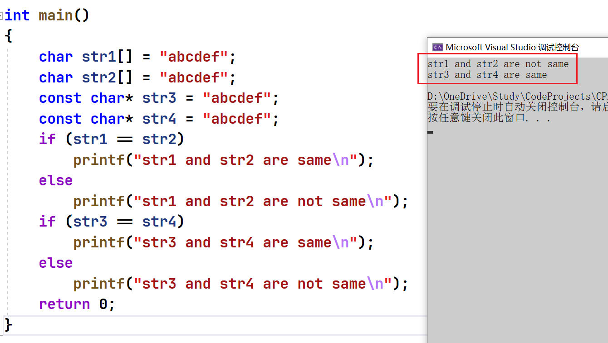

在初始指针中学到：
1. 指针就是个变量，用来存放地址，地址唯一标识一块内存空间。
2. 指针的大小是固定的4/8个字节（32位平台/64位平台）。
3. 指针是有类型，指针的类型决定了指针的+-整数的步长，指针解引用操作的时候的权限。
4. 指针的运算。

# 1 字符指针
字符指针`char*`

```c
int main()
{
const char* pstr = "hello world";//这里是把一个字符串放到pstr指针变量里了吗？
printf("%s\n", pstr);
return 0;
}
```
把字符串`hello world` 首字符的地址放到了pstr中。即把一个常量字符串的首字符`h `的地址存放到指针变量`pstr` 中。

面试题：
```c
#include <stdio.h>
int main()
{
	char str1[] = "abcdef";
	char str2[] = "abcdef";
	const char* str3 = "abcdef";
	const char* str4 = "abcdef";
	if (str1 == str2)
		printf("str1 and str2 are same\n");
	else
		printf("str1 and str2 are not same\n");
	if (str3 == str4)
		printf("str3 and str4 are same\n");
	else
		printf("str3 and str4 are not same\n");
	return 0;
}
```
结果为：

这里str3和str4指向的是一个同一个常量字符串。C/C++会把常量字符串存储到单独的一个内存区域，当几个指针
指向同一个字符串的时候，他们实际会指向同一块内存。但是用相同的常量字符串去初始化不同的数组的时候就会
开辟出不同的内存块。所以str1和str2不同，str3和str4相同。
